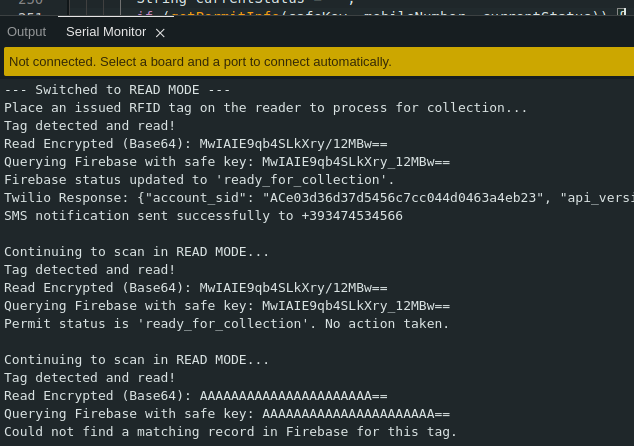
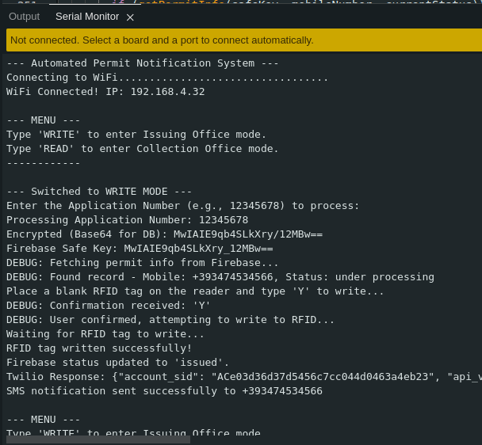
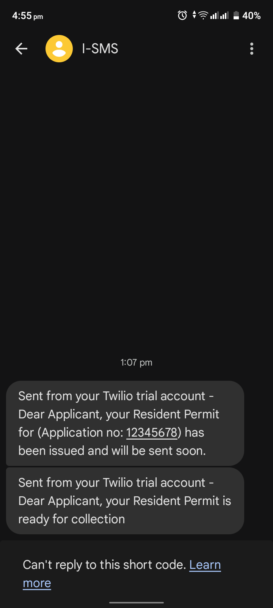
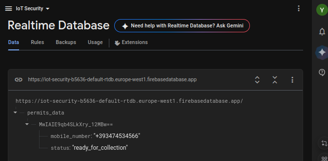
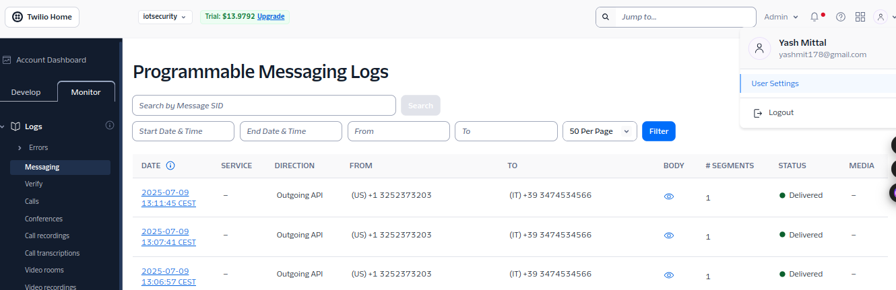

# 📡 IoT-Based Automated Permit Notification System ✉️

This repository contains the firmware for a prototype of an IoT-based system designed to automate SMS notifications for a residence permit processing workflow. Using a single ESP8266-based microcontroller, the system can simulate two key stages of the process: issuing a permit and preparing it for collection.

The core of the system leverages an RFID tag to store a secure identifier, a cloud database to manage applicant data, and a cloud communication API to send real-time status updates via SMS.

---

## 📋 Table of Contents
- Tech Stack
- System Architecture
- Hardware Requirements
- Wiring Diagram
- Setup and Installation Guide
  - Part 1: Arduino IDE Setup
  - Part 2: Twilio Account Setup
  - Part 3: Google Firebase Setup
- Project Configuration
- Running the Project
- Troubleshooting

---

## 💻 Tech Stack
* **Microcontroller:** Wemos D1 R2 (ESP8266)
* **RFID:** MFRC522 Reader/Writer with Mifare Classic 1K tags
* **Cloud Database:** Google Firebase Realtime Database
* **SMS Gateway:** Twilio API
* **Security:** AES-128 Encryption (`Crypto` library) 🔒
* **Development Environment:** Arduino IDE

---

## ⚙️ System Architecture
The firmware operates in two distinct modes, controlled via the Serial Monitor:

1.  **✍️ `WRITE_MODE` (Issuing Office Simulation):**
    * An operator enters a human-readable Application Number.
    * The ESP8266 encrypts this number using AES-128.
    * It queries Firebase using a URL-safe version of the encrypted key to retrieve the applicant's mobile number.
    * Upon confirmation, the raw encrypted data is written to a Mifare Classic 1K RFID tag.
    * The permit's status in Firebase is updated from `under processing` to `issued`.
    * A "Permit Issued" SMS is sent to the applicant via Twilio.

2.  **📖 `READ_MODE` (Collection Office Simulation):**
    * The device continuously scans for RFID tags.
    * When a tag is detected, the ESP8266 reads and decrypts the Application Number.
    * It queries Firebase to check the permit's status.
    * If the status is `issued`, it updates the status to `ready_for_collection`.
    * A "Ready for Collection" SMS is sent to the applicant via Twilio.

---

## 🔩 Hardware Requirements
* Wemos D1 R2 (or any ESP8266-based board like NodeMCU, Wemos D1 Mini)
* MFRC522 RFID Reader/Writer Module
* Mifare Classic 1K RFID Card and/or Key Fob
* Jumper Wires
* Micro USB Cable
* A stable 5V/1A USB power adapter (highly recommended) 🔌

---

## ⚡️ Wiring Diagram
Connect the MFRC522 module to the Wemos D1 R2 board as follows. This uses the hardware SPI pins for maximum performance.

| MFRC522 Pin | Wemos D1 R2 Pin | Function |
| :--- | :--- | :--- |
| **3.3V** | `3V3` | Power |
| **GND** | `GND` | Ground |
| **RST** | `D3` | Reset |
| **SDA (CS)**| `D2` | Slave Select |
| **MOSI** | `D7` | Master Out, Slave In |
| **MISO** | `D6` | Master In, Slave Out |
| **SCK** | `D5` | Serial Clock |

---

## 🛠️ Setup and Installation Guide

### Part 1: Arduino IDE Setup ⌨️

1.  **Install Arduino IDE:** Download and install the latest version from the [official Arduino website](https://www.arduino.cc/en/software).

2.  **Install ESP8266 Board Manager:**
    * Open Arduino IDE, go to `File` > `Preferences`.
    * In the "Additional Boards Manager URLs" field, paste the following URL:
        ```
        https://arduino.esp8266.com/stable/package_esp8266com_index.json
        ```
    * Go to `Tools` > `Board` > `Boards Manager...`.
    * Search for "esp8266" and install the `esp8266 by ESP8266 Community` package.

3.  **Install USB-to-Serial Driver:** Most Wemos boards use the CH340 chip. If your computer doesn't recognize the board, download and install the driver for your OS ([Windows](https://sparks.gogo.co.nz/ch340.html), [macOS](https://github.com/adrianmihalko/ch340g-ch34g-ch34x-mac-os-x-driver), Linux usually has it built-in).

4.  **Select Board and Port:**
    * In Arduino IDE, go to `Tools` > `Board` > `ESP8266 Boards` and select **`LOLIN(WEMOS) D1 R2 & mini`**.
    * Connect your board and select its COM port under `Tools` > `Port`.

5.  **Install Required Libraries:**
    * Go to `Sketch` > `Include Library` > `Manage Libraries...`.
    * Search for and install each of the following libraries:
        * `MFRC522` by GithubCommunity
        * `Crypto` by Rhys Weatherley
        * `Base64` by Xander Electronics
        * `ArduinoJson` by Benoit Blanchon
    * **Important:** If you have the `AESLib` library installed from previous attempts, please remove it to prevent conflicts.

6.  **Access Serial Monitor:** The Serial Monitor is the primary interface for this project. Access it via `Tools` > `Serial Monitor` or the magnifying glass icon in the top right. Ensure the baud rate is set to **115200**.

### Part 2: Twilio Account Setup 📱

1.  **Create a Free Trial Account:** Go to the [Twilio sign-up page](https://www.twilio.com/try-twilio) and create a free trial account.

2.  **Get a Trial Phone Number:** Follow the on-screen prompts in your Twilio dashboard to get your first virtual phone number. This is the number that will send the SMS messages. This is 'TWILIO_FROM_NUMBER' constant for the code.

3.  **Find Account SID and Auth Token:**
    * On your main Twilio project dashboard (the "Console"), you will find your **Account SID** and **Auth Token**.
    * These are the credentials you will copy into the Arduino code.

4.  **Trial Credits:** Your trial account comes with free credits (e.g., ~$15). SMS messages to most regions cost a fraction of a dollar (e.g., ~$0.09), so the trial credits are more than enough for development and testing.

### Part 3: Google Firebase Setup 🔥

1.  **Create a Firebase Project:**
    * Go to the [Firebase Console](https://console.firebase.google.com/) and sign in with your Google account.
    * Click "Add project" and follow the steps to create a new project.

2.  **Set up Realtime Database:**
    * From your project's dashboard, go to `Build` > `Realtime Database`.
    * Click "Create Database" and choose a server location.
    * Select **"Start in test mode"**. This allows read/write access for 30 days, which is ideal for development.

3.  **Set Database Rules:**
    * In the Realtime Database section, click on the `Rules` tab.
    * Replace the existing rules with the following to allow public access (for development only):
        ```json
        {
            "rules": {
                "permits_data": {
                    "$app_id": {
                        ".read": true,
                        ".write": true 
                    }
                }
            }
        }
        ```
    * Click "Publish".

4.  **Pre-populate the Database:** The system works by looking up records using a pre-calculated encrypted key. You must create these records in Firebase *before* you can process them.
    * **Step A: Get the Key:** Go to encryption_base64.ino file in the repository, change the 'appNumberToTest' string value to your desired application number in the Arduino code. Upload this to your board and open the Serial Monitor. It will print the encrypted, Base64 version of the test application number (e.g., "12345678").
    * **Step B: Sanitize the Key:** The generated key may contain a `/` character. You must manually replace any `/` with `_` and any `+` with `-` to make it a valid Firebase key. The code does this automatically when running, but you must do it manually for this initial setup.
    * **Step C: Create the Record:** In your Firebase console, click the `+` icon next to your database name.
        * For the **key/name**, paste the sanitized key from Step B.
        * Click the `+` again next to your new key to add child nodes.
        * Create a child named `mobile_number` and set its value to the applicant's phone number (e.g., `+15551234567`). Select Value type as string.
        * Create another child named `status` and set its value to `under processing`. Select Value type as string.
    * **Step D: Clean Up:** Switch to iotsecurity.ino file and proceed as follows.

---

## 🔧 Project Configuration
Open the `.ino` sketch file and fill in your unique credentials in the configuration section at the top of the file:
```cpp
// ****** 1. WIFI CREDENTIALS ******
const char* WIFI_SSID = "__REPLACE THIS__";
const char* WIFI_PASSWORD = "__REPLACE THIS__";

// ****** 2. FIREBASE CONFIG ******
#define FIREBASE_HOST "__REPLACE THIS__"

// ****** 3. TWILIO CONFIG ******
const char* TWILIO_ACCOUNT_SID = "__REPLACE THIS__";
const char* TWILIO_AUTH_TOKEN = "__REPLACE THIS__";
const char* TWILIO_FROM_NUMBER = "__REPLACE THIS__";
```

---

## ▶️ Running the Project

1.  **Upload the Code:** With all credentials filled in, upload the code to your Wemos D1 R2.
2.  **Open Serial Monitor:** Open the monitor at **115200 baud**. You should see the system connect to WiFi and display the main menu.
3.  **To Use `WRITE_MODE`:**
    * Type `WRITE` and press Enter.
    * The system will prompt you for an Application Number. Type the number you pre-populated in Firebase (e.g., `12345678`) and press Enter.
    * The system will fetch the data from Firebase. If successful, it will ask you to place a tag on the reader and confirm with `Y`.
    * Upon confirmation, the tag is written, the Firebase status is updated, and an SMS is sent.
4.  **To Use `READ_MODE`:**
    * Type `READ` and press Enter.
    * The system will now continuously scan.
    * Place the tag you just wrote in `WRITE_MODE` on the reader.
    * The system will read the tag, update the Firebase status, and send the "Ready for Collection" SMS.

---

## 📷 Gallery





